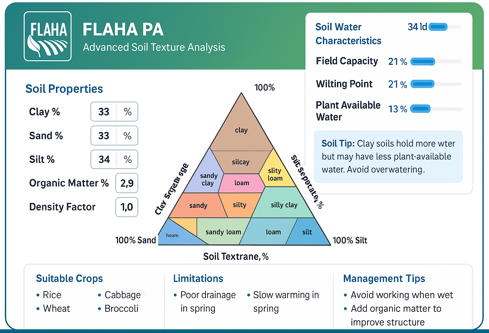

<!-- @format -->

# FlahaSoil - Advanced Soil Texture Analysis

<div align="center">
  

**Part of Flaha Agri Tech Precision Agriculture Division**

[](https://opensource.org/licenses/MIT)
[](https://[https://github.com/rafatahmed/FlahaSoil])
[](https://flaha.org)

</div>

## About FlahaSoil

<

FlahaSoil is a professional-grade soil texture analysis tool developed by **Flaha Agri Tech's Precision Agriculture Division**. This advanced web application provides interactive USDA Soil Textural Triangle visualization, helping agricultural professionals, farmers, soil scientists, and researchers understand soil composition, water characteristics, and crop suitability.

As part of the Flaha PA suite of digital agricultural tools, FlahaSoil combines scientific accuracy with user-friendly design to deliver actionable insights for precision agriculture applications.

### Key Benefits

- **Precision Agriculture**: Make data-driven decisions for optimal crop management
- **Water Management**: Understand soil water dynamics for efficient irrigation
- **Crop Planning**: Select appropriate crops based on soil characteristics
- **Educational Tool**: Learn about soil science principles and applications

## Features

### 🎯 **Core Analysis Tools**

- **Interactive USDA Soil Triangle**: Professional-grade visualization with precise soil texture classification
- **Real-time Calculations**: Instant analysis using scientifically validated pedotransfer functions
- **Manual Input Controls**: Direct entry of sand and clay percentages with automatic silt calculation
- **Advanced Soil Parameters**: Organic matter content and density factor adjustments for enhanced accuracy

### 💧 **Water Characteristics Analysis**

- **Comprehensive Water Properties**: Field capacity, wilting point, plant available water, saturation, and hydraulic conductivity
- **Visual Water Zone Representation**: Interactive soil column showing gravitational, plant-available, and unavailable water zones
- **Progress Bar Indicators**: Easy-to-read visual comparisons of water characteristics
- **Scientific Accuracy**: Based on Saxton & Rawls (2006) pedotransfer functions

### 🌱 **Agricultural Intelligence**

- **Crop Suitability Analysis**: Data-driven crop recommendations based on soil properties
- **Management Guidelines**: Professional tips for soil improvement and crop optimization
- **Limitation Assessments**: Identification of potential soil constraints and solutions

### 🎨 **Professional Interface**

- **Flaha PA Branding**: Consistent with Flaha Agri Tech's professional design standards
- **Responsive Design**: Optimized for desktop, tablet, and mobile devices
- **Intuitive User Experience**: Clean, modern interface designed for agricultural professionals
- **Educational Resources**: Built-in explanations of soil science concepts

## Quick Start

### 🌐 **Online Access**

FlahaSoil is available online as part of the Flaha PA digital agriculture suite:

- **Production**: [flahasoil.flaha.org](https://flahasoil.flaha.org) _(Coming Soon)_
- **Demo**: Open `index.html` directly in your web browser

### 💻 **Local Development**

1. **Clone the Repository**:

   ```bash
   git clone https://github.com/flaha-agritech/flahasoil.git
   cd flahasoil
   ```

2. **Run Locally** (No build process required):

   ```bash
   # Option 1: Python
   python -m http.server 8000

   # Option 2: Node.js
   npx live-server

   # Option 3: PHP
   php -S localhost:8000
   ```

3. **Access the Application**:
   Open your browser to `http://localhost:8000`

### 🚀 **Deployment**

**Static Hosting** (Recommended):

- Upload all files to your web server
- Compatible with: Netlify, Vercel, GitHub Pages, AWS S3, etc.

**Requirements**:

- Modern web browser with JavaScript enabled
- Internet connection for Google Fonts and D3.js CDN

## User Guide

### 🎯 **Getting Started with FlahaSoil**

1. **Access the Application**:

   - Open FlahaSoil in your web browser
   - The professional Flaha PA interface will load with the soil triangle visualization

2. **Understanding the Interface**:
   - **Header**: Displays Flaha PA branding and FlahaSoil title
   - **Input Controls**: Clean, branded input fields for soil parameters
   - **Soil Triangle**: Interactive USDA classification triangle
   - **Results Panels**: Organized sections for water characteristics and recommendations

### 📊 **Basic Analysis Workflow**

1. **Input Soil Composition**:

   - **Method 1**: Click directly on the soil triangle to select a composition
   - **Method 2**: Enter Clay % and Sand % in the input fields
   - Silt % is automatically calculated (Clay + Sand + Silt = 100%)
   - Click "Update Point" to apply manual entries

2. **View Soil Classification**:

   - The selected point appears on the triangle with a red indicator
   - Soil texture class is displayed prominently below the triangle
   - Coordinates show exact percentages of each particle size

3. **Analyze Water Characteristics**:
   - Review calculated water properties in the results panel
   - Use progress bars for quick visual comparison
   - Examine the soil water zones visualization

### ⚙️ **Advanced Analysis Features**

1. **Fine-tune Soil Parameters**:

   - **Organic Matter %**: Adjust from 0-8% to account for soil organic content
   - **Density Factor**: Modify from 0.9-1.2 to reflect soil compaction levels
   - These adjustments improve calculation accuracy for specific field conditions

2. **Interpret Professional Results**:

   - **Field Capacity**: Optimal water content for plant growth
   - **Wilting Point**: Critical moisture threshold for plant survival
   - **Plant Available Water**: Total water accessible to crops
   - **Saturation**: Maximum soil water holding capacity
   - **Hydraulic Conductivity**: Soil drainage and infiltration rate

3. **Agricultural Decision Support**:
   - **Crop Recommendations**: Science-based suggestions for suitable crops
   - **Management Tips**: Professional guidance for soil improvement
   - **Limitation Analysis**: Identification of potential constraints and solutions

## Technical Details

### Soil Water Calculations

The application uses the Saxton & Rawls (2006) pedotransfer functions to estimate soil water characteristics:

1. **Field Capacity (FC)**: Water content after gravity drainage (33 kPa tension)

   - Calculated using sand, clay, and organic matter percentages
   - Adjusted for soil density

2. **Wilting Point (WP)**: Water content at which plants can no longer extract water (1500 kPa tension)

   - Represents the lower limit of plant-available water
   - Strongly influenced by clay content

3. **Plant Available Water (PAW)**: Water available for plant use

   - Calculated as FC - WP
   - Critical for irrigation planning

4. **Saturation**: Maximum water content when all pores are filled

   - Represents the upper limit of soil water content
   - Used to estimate porosity

5. **Saturated Hydraulic Conductivity**: Rate of water movement through saturated soil
   - Indicates drainage capacity
   - Important for irrigation and drainage design

### Adjustments for Organic Matter and Density

The calculations incorporate:

- Organic matter effects on water retention
- Soil density impacts on pore space and water holding capacity

### Soil Texture Classification

The USDA soil textural triangle classifies soils into 12 textural classes based on the percentages of sand, silt, and clay particles:

- Sand: 2.0-0.05 mm
- Silt: 0.05-0.002 mm
- Clay: <0.002 mm

## Technology Stack

### 🛠️ **Core Technologies**

- **Frontend**: HTML5, CSS3, JavaScript (ES6+)
- **Visualization**: D3.js v7 for interactive soil triangle
- **Styling**: CSS Grid, Flexbox, CSS Variables
- **Fonts**: Google Fonts (Montserrat, Open Sans)
- **Icons**: Custom Flaha PA iconography

### 📱 **Responsive Design**

- Mobile-first approach
- Optimized for tablets and desktop
- Touch-friendly interface
- Cross-browser compatibility

## Scientific References

### 📚 **Data Sources and Methodology**

- **Soil Classification**: USDA Soil Textural Triangle (USDA-NRCS)
- **Pedotransfer Functions**: Saxton, K.E., and W.J. Rawls. 2006. "Soil Water Characteristic Estimates by Texture and Organic Matter for Hydrologic Solutions." _Soil Science Society of America Journal_ 70:1569-1578.
- **Crop Recommendations**: Compiled from USDA Extension publications and peer-reviewed agricultural research
- **Water Dynamics**: Based on established soil physics principles and field validation studies

### 🔬 **Validation and Accuracy**

FlahaSoil's calculations have been validated against field measurements and are suitable for:

- Preliminary soil assessment
- Educational purposes
- Agricultural planning support
- Research applications

_Note: For critical agricultural decisions, field testing and professional soil analysis are recommended._

## About Flaha Agri Tech

### 🌱 **Company Overview**

Flaha Agri Tech, established in Qatar in April 2022, is a leading agricultural technology company with three specialized divisions:

- **Flaha LA** (Landscape Architecture): Landscape contracting and maintenance
- **Flaha PA** (Precision Agriculture): Digital agricultural tools and solutions
- **Flaha AG** (Agriculture): Farm management and agricultural products

### 🎯 **Flaha PA Division**

The Precision Agriculture division develops cutting-edge digital tools for modern farming:

- **FlahaSoil**: Soil texture analysis (this application)
- **Flahafert Calc**: Fertilizer calculation tools
- **Evapotran.flaha.org**: Evapotranspiration calculations
- **Additional PA Tools**: Coming soon

### 📞 **Contact Information**

- **Website**: [flaha.org](https://flaha.org)
- **Email**: pa@flaha.org
- **Location**: Qatar
- **Division**: Precision Agriculture (PA)

## License & Usage

### 📄 **License**

This project is licensed under the MIT License - see the LICENSE file for details.

### 🤝 **Contributing**

We welcome contributions from the agricultural technology community!

1. Fork the repository
2. Create your feature branch (`git checkout -b feature/amazing-feature`)
3. Commit your changes (`git commit -m 'Add some amazing feature'`)
4. Push to the branch (`git push origin feature/amazing-feature`)
5. Open a Pull Request

### 🐛 **Support**

For technical support or feature requests:

- Create an issue on GitHub
- Contact the Flaha PA team at pa@flaha.org
- Visit our documentation at [docs.flaha.org](https://docs.flaha.org)

---

<div align="center">
  <p><strong>FlahaSoil</strong> - Part of the Flaha PA Digital Agriculture Suite</p>
  <p>© 2024 Flaha Agri Tech. All rights reserved.</p>
  <p>Empowering Agriculture Through Technology</p>
</div>
