<!-- @format -->

# 🚀 FlahaSoil Advanced DSS Calculation Framework - Complete Scientific Foundation

## 🎯 **Executive Summary**

This document frames the comprehensive **Decision Support System (DSS)** for FlahaSoil, integrating advanced irrigation calculations based on soil analysis results from `index.html`. The framework combines **FlahaCalc ET₀ calculations**, **FAO-56 crop coefficients**, **BBCH growth stages**, and **localized Kc estimation** to create a world-class irrigation decision support platform.

**Vision:** _Transform soil analysis into actionable irrigation intelligence for farmers, designers, and consultants_

---

## 📊 **DSS Architecture Overview**

### 🎨 **High-Level Architecture Diagram**

```mermaid
graph TB
    A[👨‍🌾 User: Farmer/Designer/Consultant] --> B[🌐 FlahaSoil Landing Page]
    B --> C[🧪 Soil Analysis - index.html]
    C --> D[📊 Soil Results: PAW, Ksat, Texture]
    D --> E[🚀 Advanced DSS Page]

    E --> F[🌱 Crop Selection & Field Config]
    E --> G[🌤️ Weather/ET₀ Integration]
    E --> H[📈 Calculation Engine]

    F --> I[(🗄️ Crop Database<br/>BBCH + Kc Values)]
    G --> J[☀️ FlahaCalc API<br/>Weather APIs]

    H --> K[💧 Irrigation Recommendations]
    H --> L[🏗️ System Design Specs]
    H --> M[💰 Economic Analysis]

    K --> N[📱 Smart Dashboard]
    L --> N
    M --> N

    N --> O[📄 Custom Reports<br/>Multi-language]
    N --> P[📅 Irrigation Schedule]
    N --> Q[🔔 Mobile Alerts]

    style A fill:#e1f5fe
    style E fill:#f3e5f5
    style H fill:#fff3e0
    style N fill:#e8f5e8
```



### 🔄 **Data Integration Pipeline:**

```
FlahaSoil (index.html) → Soil Properties → DSS Engine → Irrigation Intelligence
        ↓                      ↓              ↓                    ↓
   PAW, Ksat, BD    →    FlahaCalc ET₀   →   Crop Kc    →    Smart Scheduling
        ↓                      ↓              ↓                    ↓
   Infiltration     →    Weather APIs    →   BBCH Stages →   System Design
        ↓                      ↓              ↓                    ↓
   Texture Class    →    Climate Data    →   Growth Periods →   Economic ROI
```

### 👥 **User Journey Flows**

#### **🌾 Farmer Journey:**

```
1. Soil Analysis → 2. Crop Selection → 3. Simple Recommendations → 4. Irrigation Schedule → 5. Mobile Alerts
```

#### **🏗️ Designer Journey:**

```
1. Soil Analysis → 2. System Requirements → 3. Technical Specifications → 4. Component Lists → 5. Professional Report
```

#### **🌱 Consultant Journey:**

```
1. Multi-Field Analysis → 2. Comparative Studies → 3. Advanced Analytics → 4. Client Reports → 5. Portfolio Management
```

### 🧠 **Core Calculation Modules:**

#### **1. Soil-to-Irrigation Intelligence Engine**

- **Input:** FlahaSoil analysis (PAW, infiltration rate, Ksat, bulk density)
- **Process:** Convert soil water characteristics to irrigation parameters
- **Output:** Maximum application rates, irrigation depths, frequency recommendations

#### **2. Crop Evapotranspiration Calculator**

- **Input:** FlahaCalc ET₀ + Crop Kc coefficients + Growth stages
- **Process:** ETc = ET₀ × Kc (FAO-56 methodology)
- **Output:** Daily/seasonal water requirements per crop

#### **3. Smart Irrigation Scheduler**

- **Input:** ETc + Soil characteristics + Weather forecasts
- **Process:** Optimize timing, frequency, and application rates
- **Output:** Automated irrigation schedules with alerts

#### **4. Economic Decision Optimizer**

- **Input:** System costs + Water savings + Yield projections
- **Process:** ROI analysis with payback calculations
- **Output:** Cost-benefit recommendations and financing options

---

## 🌱 **Scientific Foundation**

### **1. FAO-56 Methodology Integration**

Based on Allen et al. (1998) - the global standard for crop water requirements:

#### **Core Equation:**

```
ETc = ET₀ × Kc
```

- **ETc:** Crop evapotranspiration (mm/day)
- **ET₀:** Reference evapotranspiration from FlahaCalc
- **Kc:** Crop coefficient (stage-specific)

#### **Irrigation Depth Calculation:**

```
Irrigation Depth = (Depletion fraction × PAW × Root depth) / Application efficiency
```

### **2. BBCH Growth Stage Integration**

Comprehensive crop development tracking with 13 major crops:

#### **Growth Stage Matrix:**

- **Cereals:** Wheat, Maize, Barley (BBCH 00-99)
- **Vegetables:** Tomato, Cucumber, Eggplant, Pepper, Potato, Onion
- **Forages:** Bermuda Grass, Alfalfa, Ryegrass, Sudan Grass
- **Field Crops:** Sunflower, Soybean

#### **Kc Period Mapping:**

| Growth Period        | BBCH Stages | Kc Range  | Duration (Days) |
| -------------------- | ----------- | --------- | --------------- |
| Initial (Kc_ini)     | 00-19       | 0.3-0.8   | 15-40           |
| Development          | 20-39       | 0.7-1.0   | 25-60           |
| Mid-season (Kc_mid)  | 40-69       | 0.95-1.25 | 30-90           |
| Late season (Kc_end) | 70-99       | 0.25-0.9  | 15-40           |

### **3. Localized Kc Estimation Algorithm**

Scientific approach for GCC/MENA region customization:

#### **Step-by-Step Process:**

1. **Baseline Kc Retrieval** (FAO-56 tables)
2. **Climate Adjustment** (+0.05-0.10 for hot/arid conditions)
3. **Irrigation Method Adjustment** (-0.10-0.20 for drip systems)
4. **Crop Variety Adjustment** (±0.05-0.10 for canopy density)
5. **Field Validation** (soil moisture/yield calibration)
6. **Documentation** (source tracking and references)

---

## 🔧 **Advanced Calculation Engines**

### **1. Irrigation Requirement Calculator**

```javascript
function calculateIrrigationNeeds(soilData, cropData, climateData) {
	// From FlahaSoil analysis
	const fieldCapacity = soilData.fieldCapacity;
	const wiltingPoint = soilData.wiltingPoint;
	const availableWater = fieldCapacity - wiltingPoint;
	const infiltrationRate = soilData.saturatedConductivity;

	// From FlahaCalc integration
	const ET0 = climateData.referenceET;

	// From crop database
	const Kc = getCropCoefficient(cropData.type, cropData.growthStage);
	const rootDepth = cropData.rootingDepth;

	// Core calculations
	const ETc = ET0 * Kc;
	const irrigationDepth = (0.5 * availableWater * rootDepth) / 0.85; // 85% efficiency
	const frequency = irrigationDepth / ETc; // days
	const maxApplicationRate = Math.min(infiltrationRate, 25); // mm/hr limit

	return {
		dailyWaterNeed: ETc,
		irrigationDepth: irrigationDepth,
		frequency: Math.max(1, Math.round(frequency)),
		maxApplicationRate: maxApplicationRate,
		systemRecommendation: getSystemRecommendation(soilData, irrigationDepth),
	};
}
```

### **2. System Design Optimizer**

```javascript
function designIrrigationSystem(soilData, fieldData, budget) {
	const soilType = soilData.textureClass;
	const infiltrationRate = soilData.saturatedConductivity;
	const fieldSize = fieldData.area;

	// System selection logic
	if (soilType.includes("Sandy") && infiltrationRate > 25) {
		return {
			system: "Drip Irrigation",
			efficiency: 0.9,
			cost: calculateDripCost(fieldSize),
			components: getDripComponents(fieldData),
			installation: "Professional recommended",
		};
	} else if (infiltrationRate > 10 && infiltrationRate <= 25) {
		return {
			system: "Sprinkler System",
			efficiency: 0.75,
			cost: calculateSprinklerCost(fieldSize),
			components: getSprinklerComponents(fieldData),
			installation: "Moderate complexity",
		};
	} else {
		return {
			system: "Surface/Flood Irrigation",
			efficiency: 0.6,
			cost: calculateSurfaceCost(fieldSize),
			components: getSurfaceComponents(fieldData),
			installation: "Simple implementation",
		};
	}
}
```

### **3. Economic Analysis Engine**

```javascript
function calculateROI(systemCost, waterSavings, yieldIncrease, years = 10) {
	const annualWaterSavings = waterSavings * 365 * 0.001; // m³/year
	const waterCostSavings = annualWaterSavings * 2.5; // $/m³ (regional average)
	const yieldValueIncrease = yieldIncrease * 1000; // $/year
	const totalAnnualSavings = waterCostSavings + yieldValueIncrease;

	const paybackPeriod = systemCost / totalAnnualSavings;
	const totalSavings = totalAnnualSavings * years;
	const netProfit = totalSavings - systemCost;
	const roi = (netProfit / systemCost) * 100;

	return {
		paybackPeriod: Math.round(paybackPeriod * 10) / 10,
		roi: Math.round(roi),
		annualSavings: Math.round(totalAnnualSavings),
		netProfit: Math.round(netProfit),
		breakEvenYear: Math.ceil(paybackPeriod),
	};
}
```

---

## 📱 **DSS User Interface Framework**

### **1. Progressive Disclosure Design**

```
Level 1 (Farmers): Simple recommendations and scheduling
Level 2 (Designers): Technical specifications and system design
Level 3 (Consultants): Advanced analytics and multi-field management
```

### **2. Dashboard Components**

- **Soil Analysis Summary** (from index.html)
- **Crop & Field Configuration** (interactive selection)
- **Smart Recommendations** (automated calculations)
- **Economic Analysis** (ROI and cost-benefit)
- **Scheduling Calendar** (irrigation timing)
- **System Design Tools** (component specifications)

### **3. Integration Points**

- **Weather APIs:** Real-time ET₀ and forecast data
- **FlahaCalc Integration:** Direct ET₀ import from evapotran.flaha.org
- **Crop Databases:** BBCH stages and Kc coefficients
- **Equipment Catalogs:** System components and pricing

---

## 🌍 **DSS Output Customization & Localization**

### **📄 Multi-Language Support**

FlahaSoil DSS provides comprehensive localization for MENA region:

#### **Supported Languages:**

- **🇸🇦 Arabic (العربية)** - Primary for GCC markets
- **🇫🇷 French (Français)** - North Africa (Morocco, Tunisia, Algeria)
- **🇬🇧 English** - International standard
- **🇹🇷 Turkish (Türkçe)** - Regional expansion
- **🇮🇷 Persian (فارسی)** - Iran market potential

#### **Localization Features:**

- **RTL Support** for Arabic and Persian interfaces
- **Cultural Units** (metric system, local currency)
- **Regional Crop Names** (local varieties and terminology)
- **Climate-Specific Recommendations** (desert, Mediterranean, continental)

### **📊 Custom Report Templates**

#### **🌾 Farm Management Reports**

```
Template: Farm Operations Dashboard
- Irrigation schedule calendar
- Water usage tracking
- Crop performance metrics
- Cost analysis per season
- Sustainability indicators
```

#### **🏢 Consultant Professional Reports**

```
Template: Client Advisory Package
- Multi-field comparative analysis
- ROI projections and recommendations
- Technical specifications summary
- Implementation timeline
- Risk assessment matrix
```

#### **🏛️ Government & Policy Reports**

```
Template: Regional Water Management
- Aggregate water usage statistics
- Conservation impact assessments
- Policy compliance tracking
- Environmental sustainability metrics
- Economic impact analysis
```

#### **🌱 ESG Reporting Templates**

```
Template: Environmental Impact Assessment
- Water conservation achievements
- Carbon footprint reduction
- Soil health improvement metrics
- Biodiversity impact indicators
- Sustainable agriculture compliance
```

### **📱 Export & Integration Options**

- **PDF Reports** (A4/Letter, multi-language)
- **Excel Dashboards** (pivot tables, charts)
- **API Data Feeds** (JSON/XML for third-party systems)
- **Mobile App Sync** (offline capability)
- **GIS Integration** (KML/Shapefile export)

---

## 🎯 **Implementation Roadmap**

### **Phase 1: Foundation (4 weeks)**

- Data integration from index.html to DSS
- Basic irrigation calculator implementation
- Crop database with Kc coefficients
- UI framework with responsive design

### **Phase 2: Intelligence (5 weeks)**

- FlahaCalc API integration
- Weather data integration
- BBCH growth stage tracking
- Economic analysis tools

### **Phase 3: Optimization (4 weeks)**

- Machine learning recommendations
- Multi-field management
- Advanced reporting suite
- Mobile application

### **Phase 4: Scale (4 weeks)**

- Enterprise features
- API marketplace
- White-label solutions
- Global localization

---

## � **Security & Data Privacy**

### **🛡️ Data Protection Framework**

#### **Global Compliance Standards:**

- **🇪🇺 GDPR Compliance** - European data protection regulations
- **🇶🇦 Qatar Data Protection Law** - Local regulatory compliance
- **🇸🇦 Saudi PDPL** - Personal Data Protection Law compliance
- **🇦🇪 UAE Data Protection Law** - Federal data protection standards

#### **Security Measures:**

- **🔐 End-to-End Encryption** - All data transmission secured (TLS 1.3)
- **🏦 Bank-Grade Security** - AES-256 encryption for data at rest
- **🔑 Multi-Factor Authentication** - Enhanced user account protection
- **🛡️ Regular Security Audits** - Quarterly penetration testing
- **📊 Anonymized Analytics** - No personal data in calculation logs

#### **Privacy Commitments:**

```
✅ All calculations anonymized and secure
✅ User data never sold or shared with third parties
✅ Transparent data usage policies
✅ Right to data deletion (GDPR Article 17)
✅ Data portability options available
✅ Local data residency options for GCC clients
```

#### **Data Handling Principles:**

- **Minimal Data Collection** - Only essential information required
- **Purpose Limitation** - Data used solely for irrigation calculations
- **Retention Limits** - Automatic data purging after defined periods
- **User Control** - Full access to personal data and usage logs
- **Audit Trails** - Complete logging of data access and modifications

### **🌐 Regional Data Sovereignty**

- **GCC Data Centers** - Local hosting for regional compliance
- **Cross-Border Controls** - Restricted data transfer protocols
- **Government Reporting** - Compliance with local agricultural policies
- **Industry Standards** - ISO 27001 and SOC 2 Type II certification

---

## �📊 **Success Metrics**

### **Technical Performance:**

- **Calculation Accuracy:** ±5% of field measurements
- **Response Time:** <2 seconds for recommendations
- **Data Integration:** 99.9% uptime with external APIs
- **User Adoption:** 80% feature utilization rate

### **Business Impact:**

- **Water Conservation:** 25% average reduction
- **Yield Improvement:** 15% average increase
- **Cost Savings:** $500 average annual savings per farm
- **ROI Achievement:** 200% return within 3 years

### **User Satisfaction:**

- **Ease of Use:** 4.5/5 rating
- **Recommendation Accuracy:** 90% user validation
- **Support Response:** <24 hours
- **Feature Requests:** 95% implementation rate

---

## � **Future-Proofing & Innovation Roadmap**

### **🤖 AI/ML Integration Pipeline**

#### **Phase 1: Smart Kc Calibration (Year 2)**

```javascript
// Machine learning for localized Kc optimization
const MLKcCalibrator = {
	inputs: ["soil_data", "weather_history", "yield_results", "irrigation_logs"],
	algorithm: "Random Forest + Neural Networks",
	output: "Optimized Kc values with confidence intervals",
	accuracy_target: "±3% of field measurements",
};
```

#### **Phase 2: Anomaly Detection (Year 2-3)**

- **Crop Stress Detection** - Early warning systems for water stress
- **System Performance Monitoring** - Irrigation efficiency optimization
- **Weather Pattern Recognition** - Predictive irrigation scheduling
- **Yield Prediction Models** - ROI forecasting with 90% accuracy

#### **Phase 3: Autonomous Irrigation (Year 3-5)**

- **Fully Automated Scheduling** - Zero-intervention irrigation management
- **Adaptive Learning** - System improves with each growing season
- **Multi-Crop Optimization** - Complex rotation and intercropping support
- **Climate Change Adaptation** - Dynamic adjustment to changing conditions

### **🌐 IoT & Sensor Integration Roadmap**

#### **Tier 1: Basic Sensor Support (Year 1-2)**

```
Supported Devices:
- Soil Scout sensors (soil moisture, temperature)
- Weather stations (ET₀ validation)
- Flow meters (irrigation monitoring)
- pH/EC sensors (soil chemistry)
```

#### **Tier 2: Advanced Sensor Networks (Year 2-3)**

```
Enterprise Integration:
- Satellite imagery (NDVI, crop health)
- Drone monitoring (precision agriculture)
- Smart irrigation controllers (automated valves)
- Yield monitoring systems (harvest optimization)
```

#### **Tier 3: Ecosystem Integration (Year 3-5)**

```
Platform Partnerships:
- John Deere Operations Center
- Climate FieldView integration
- Trimble Ag Software connectivity
- Valley Irrigation BaseStation
```

### **🔬 Research & Development Pipeline**

#### **Advanced Calculation Methods:**

- **Machine Learning ET₀** - Site-specific reference evapotranspiration
- **Precision Kc Mapping** - Field-scale coefficient variation
- **Stress Coefficient Integration** - Water and salinity stress factors
- **Carbon Footprint Modeling** - Sustainability impact calculations

#### **Emerging Technologies:**

- **Blockchain Verification** - Immutable irrigation records
- **Edge Computing** - Real-time field processing
- **5G Connectivity** - Ultra-low latency sensor networks
- **Digital Twins** - Virtual field modeling and simulation

---

## �🔬 **Scientific References**

### **Core Methodology:**

1. **Allen, R.G., et al. (1998).** FAO Irrigation and Drainage Paper 56 - Crop Evapotranspiration
2. **Meier, U. (2001).** BBCH Monograph - Growth Stages of Crops
3. **Pereira, L., et al. (2020).** Soil Water Balance Models for Irrigation Scheduling

### **Regional Studies:**

1. **Al-Ghobari, H.M. (2000).** ET estimation for Saudi Arabia conditions
2. **Taha, A.F., et al. (2016).** Bermuda grass coefficients in desert climate
3. **Shahrokhnia, M.H. & Sepaskhah, A.R. (2013).** Crop coefficients in semi-arid regions

### **Technical Implementation:**

1. **Liu, X., et al. (2017).** Reference ET model comparison studies
2. **Anapalli, S.S., et al. (2016).** Lysimeter data application methods
3. **D'Urso, G. & Calera Belmonte, A. (2006).** Earth observation for crop water requirements

---

## ⚡ **API Rate Limiting & Caching Strategy**

### **🚀 High-Volume Access Design**

#### **Rate Limiting Tiers:**

```javascript
const rateLimits = {
	free: { requests: 100, per: "hour", burst: 10 },
	professional: { requests: 1000, per: "hour", burst: 50 },
	enterprise: { requests: 10000, per: "hour", burst: 200 },
	api_partner: { requests: 100000, per: "hour", burst: 1000 },
};
```

#### **Intelligent Caching System:**

- **Redis Cache** - Sub-second response for repeated calculations
- **CDN Distribution** - Global edge caching for static resources
- **Database Query Optimization** - Indexed lookups for crop/Kc data
- **Calculation Memoization** - Cache complex irrigation calculations

#### **Performance Guarantees:**

- **API Response Time:** <500ms for 95% of requests
- **Uptime SLA:** 99.9% availability guarantee
- **Concurrent Users:** Support for 10,000+ simultaneous users
- **Data Throughput:** 1M+ calculations per day capacity

### **🔄 Auto-Scaling Architecture:**

- **Kubernetes Orchestration** - Dynamic resource allocation
- **Load Balancing** - Intelligent traffic distribution
- **Database Sharding** - Horizontal scaling for large datasets
- **Microservices Design** - Independent scaling of calculation engines

---

## 📊 **Strengths vs To-Do Summary**

| **✅ Strengths**                                                       | **🔄 Minor Gaps/To-Dos**                            |
| ---------------------------------------------------------------------- | --------------------------------------------------- |
| **World-class scientific basis** (FAO-56, BBCH, Saxton & Rawls)        | ~~Add security/PII brief~~ ✅ **COMPLETED**         |
| **Modern modular architecture** (microservices, API-first)             | ~~Visual architecture diagram~~ ✅ **COMPLETED**    |
| **Local & global Kc logic** (GCC/MENA customization)                   | ~~ML/data science roadmap~~ ✅ **COMPLETED**        |
| **Robust, phased implementation** (17-week roadmap)                    | ~~Customization/export/reporting~~ ✅ **COMPLETED** |
| **Practical code samples** (production-ready algorithms)               | ~~Rate limiting/caching strategy~~ ✅ **COMPLETED** |
| **Direct field ROI linkage** (economic decision support)               | **Known limitations documentation**                 |
| **Multi-language support** (Arabic, French, English, Turkish, Persian) | **Edge case handling specifications**               |
| **Comprehensive database schema** (crops, BBCH, Kc periods)            | **Disaster recovery procedures**                    |
| **Enterprise-grade security** (GDPR, local compliance)                 | **Performance benchmarking results**                |
| **Future-proof technology stack** (AI/ML, IoT integration)             | **Third-party integration testing**                 |

### **🎯 Known Limitations & Edge Cases**

#### **Technical Limitations:**

- **Extreme Weather Events** - Calculations may require manual adjustment during severe conditions
- **Non-Standard Crops** - Limited support for experimental or rare crop varieties
- **Soil Heterogeneity** - Assumes uniform soil conditions within field boundaries
- **Micro-Climate Variations** - Weather data represents regional averages

#### **Data Dependencies:**

- **Internet Connectivity** - Real-time features require stable connection
- **Weather API Availability** - Backup systems for service interruptions
- **Sensor Calibration** - IoT devices require periodic maintenance
- **Regional Data Gaps** - Some areas may have limited crop coefficient research

#### **User Experience Considerations:**

- **Learning Curve** - Advanced features may require training for new users
- **Mobile Performance** - Complex calculations may be slower on older devices
- **Language Accuracy** - Technical translations may require local expert review
- **Cultural Adaptation** - Farming practices may vary from algorithmic recommendations

---

## 🗄️ **Database Schema for DSS**

### **Core Tables:**

#### **1. Crops Table**

```sql
CREATE TABLE crops (
    id SERIAL PRIMARY KEY,
    name VARCHAR(100) NOT NULL,
    type VARCHAR(50) NOT NULL, -- Cereal, Vegetable, Forage, Field
    scientific_name VARCHAR(150),
    growth_period_min INTEGER, -- days
    growth_period_max INTEGER, -- days
    root_depth_max DECIMAL(5,2), -- meters
    created_at TIMESTAMP DEFAULT NOW()
);
```

#### **2. BBCH Stages Table**

```sql
CREATE TABLE bbch_stages (
    id SERIAL PRIMARY KEY,
    crop_id INTEGER REFERENCES crops(id),
    stage_code VARCHAR(10) NOT NULL, -- 00, 10, 20, etc.
    stage_name VARCHAR(100),
    description TEXT,
    typical_days_from_sowing INTEGER,
    INDEX(crop_id, stage_code)
);
```

#### **3. Kc Periods Table**

```sql
CREATE TABLE kc_periods (
    id SERIAL PRIMARY KEY,
    crop_id INTEGER REFERENCES crops(id),
    period_name VARCHAR(20) NOT NULL, -- Kc_ini, Kc_mid, Kc_end
    kc_value DECIMAL(4,3) NOT NULL,
    period_start_days INTEGER,
    period_end_days INTEGER,
    climate_zone VARCHAR(50), -- GCC, MENA, Temperate
    irrigation_method VARCHAR(30), -- Drip, Sprinkler, Surface
    reference_source VARCHAR(200),
    confidence_level VARCHAR(20), -- High, Medium, Low
    created_at TIMESTAMP DEFAULT NOW()
);
```

#### **4. DSS Calculations Table**

```sql
CREATE TABLE dss_calculations (
    id SERIAL PRIMARY KEY,
    user_id INTEGER REFERENCES users(id),
    soil_analysis_id INTEGER REFERENCES soil_analyses(id),
    crop_id INTEGER REFERENCES crops(id),
    field_area DECIMAL(10,2), -- hectares
    et0_value DECIMAL(6,3), -- mm/day
    etc_calculated DECIMAL(6,3), -- mm/day
    irrigation_depth DECIMAL(6,2), -- mm
    irrigation_frequency INTEGER, -- days
    system_recommendation VARCHAR(100),
    economic_roi DECIMAL(6,2), -- percentage
    calculation_date TIMESTAMP DEFAULT NOW()
);
```

---

## 🔌 **API Integration Specifications**

### **1. FlahaCalc Integration**

```javascript
// API endpoint for ET₀ data
const FLAHACALC_API = "https://evapotran.flaha.org/api/v1/et0";

async function getFlahaCalcET0(location, date) {
	const response = await fetch(
		`${FLAHACALC_API}?lat=${location.lat}&lon=${location.lon}&date=${date}`
	);
	const data = await response.json();
	return {
		et0: data.et0_penman_monteith,
		temperature: data.temperature_avg,
		humidity: data.relative_humidity,
		windSpeed: data.wind_speed,
		solarRadiation: data.solar_radiation,
	};
}
```

### **2. Weather API Integration**

```javascript
// Multiple weather service integration
const WEATHER_APIS = {
	openweather: "https://api.openweathermap.org/data/2.5",
	weatherapi: "https://api.weatherapi.com/v1",
	noaa: "https://api.weather.gov",
};

async function getWeatherForecast(location, days = 7) {
	// Implement fallback strategy across multiple APIs
	const forecast = await fetchWithFallback(WEATHER_APIS, location, days);
	return {
		daily: forecast.map((day) => ({
			date: day.date,
			et0: calculateET0(day.weather),
			precipitation: day.precipitation,
			temperature: day.temperature,
		})),
	};
}
```

### **3. Crop Database API**

```javascript
// RESTful API for crop and Kc data
app.get("/api/v1/crops/:cropId/kc", async (req, res) => {
	const { cropId } = req.params;
	const { growthStage, climateZone, irrigationMethod } = req.query;

	const kcData = await db.query(
		`
        SELECT kc_value, period_name, reference_source, confidence_level
        FROM kc_periods
        WHERE crop_id = ? AND climate_zone = ? AND irrigation_method = ?
        ORDER BY period_start_days
    `,
		[cropId, climateZone, irrigationMethod]
	);

	res.json({
		crop: await getCropDetails(cropId),
		kc_periods: kcData,
		recommendations: generateKcRecommendations(kcData, growthStage),
	});
});
```

---

## 📊 **Sample Data Structure**

### **Crop Database Sample (JSON)**

```json
{
	"crops": [
		{
			"id": 1,
			"name": "Tomato",
			"type": "Vegetable",
			"growth_period": { "min": 90, "max": 140 },
			"kc_periods": [
				{
					"period": "Kc_ini",
					"kc_value": 0.6,
					"days": "0-35",
					"bbch_stages": ["00-19"],
					"climate_adjustments": {
						"hot_arid": "+0.1",
						"temperate": "0.0",
						"humid": "-0.05"
					}
				},
				{
					"period": "Kc_mid",
					"kc_value": 1.15,
					"days": "36-90",
					"bbch_stages": ["40-69"],
					"irrigation_adjustments": {
						"drip": "-0.1",
						"sprinkler": "0.0",
						"surface": "+0.05"
					}
				}
			]
		}
	]
}
```

---

## 🎯 **Quality Assurance Framework**

### **1. Calculation Validation**

- **Cross-reference with FAO-56 standards**
- **Field measurement comparison (±5% tolerance)**
- **Peer review by agricultural engineers**
- **Automated unit testing for all calculations**

### **2. Data Quality Control**

- **Source verification for all Kc values**
- **Confidence level assignment (High/Medium/Low)**
- **Regular updates from latest research**
- **User feedback integration system**

### **3. Performance Monitoring**

- **API response time tracking (<2s target)**
- **Calculation accuracy metrics**
- **User satisfaction surveys**
- **System uptime monitoring (99.9% target)**

---

**🎯 FlahaSoil DSS: The Complete Scientific Foundation for Intelligent Irrigation Decision Support**

_Ready to transform agricultural water management through advanced soil-to-irrigation intelligence! 🚀🌱💧_
