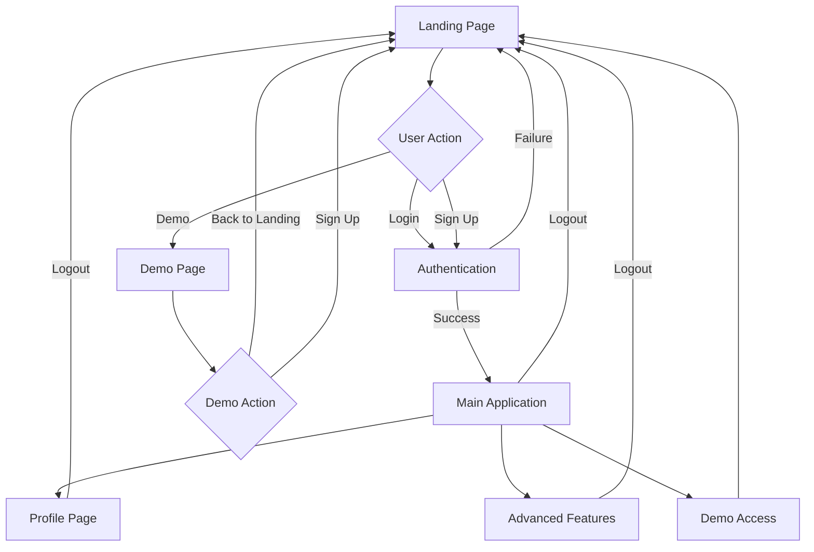

<!-- @format -->

# FlahaSoil Routing & Navigation Documentation

## Overview

This document outlines the routing and navigation architecture for the FlahaSoil web application, implementing a secure, user-friendly flow where the landing page serves as the primary gateway for all user interactions.

## Architecture Principles

### 🔐 Security-First Approach

- **Landing page as gateway**: No direct access to application without authentication
- **Centralized authentication**: All login/signup operations happen on landing page only
- **Strict access control**: Authenticated pages immediately redirect unauthenticated users
- **Token validation**: Basic integrity checks for user authentication data

### 🎯 User Experience Focus

- **Clear navigation flow**: Intuitive progression from landing → auth → application
- **Consistent branding**: Unified Flaha PA styling across all pages
- **Responsive design**: Optimized for desktop and mobile devices
- **Context-aware navigation**: Different navigation options based on authentication state

## Application Flow



## Page Structure & Routing

### 1. Landing Page (`landing.html`)

**Role**: Primary entry point and authentication gateway

**Features**:

- Hero section with value proposition
- Feature showcase
- Pricing information
- Authentication modals (login/signup)
- Demo access without authentication

**Navigation**:

- Internal sections (features, pricing, about)
- Authentication actions
- Demo access

**Authentication Flow**:

```javascript
// Successful authentication redirects to main application
if (result.success) {
	localStorage.setItem("flahasoil_token", result.token);
	localStorage.setItem("flahasoil_user", JSON.stringify(result.user));
	window.location.href = "./index.html";
}
```

### 2. Main Application (`index.html`)

**Role**: Core soil analysis functionality for authenticated users

**Access Control**:

```javascript
// Strict authentication check - no bypasses allowed
const token = localStorage.getItem("flahasoil_token");
const userStr = localStorage.getItem("flahasoil_user");

if (!token || !userStr) {
	window.location.href = "./landing.html";
	return;
}
```

**Features**:

- Soil texture analysis
- USDA triangle visualization
- Water characteristics calculation
- Advanced parameters (plan-based)
- Results visualization

**Navigation**:

- Profile access
- Demo pages
- Advanced features
- Logout functionality

### 3. Profile Page (`profile.html`)

**Role**: User account management and settings

**Access Control**: Same strict authentication as main application

**Features**:

- User information display
- Usage statistics
- Plan management
- Account settings
- Recent analyses history

### 4. Demo Page (`demo.html`)

**Role**: Public demonstration of soil analysis capabilities

**Access**: No authentication required

**Features**:

- Preset soil samples
- Limited functionality demonstration
- Clear calls-to-action for registration
- Educational content

**Navigation**:

- Back to landing page
- Registration prompts
- Feature upgrade notifications

## Navigation Components

### Header Structure

```html
<header class="flaha-header">
	<div class="header-content">
		<!-- Brand Section -->
		<div class="brand-section">
			<div class="flaha-logo">
				<span class="flaha-text">FLAHA</span>
				<span class="pa-text">PA</span>
			</div>
			<div class="brand-tagline">Precision Agriculture</div>
		</div>

		<!-- App Title -->
		<div class="app-title-section">
			<h1 class="app-title">FlahaSoil</h1>
			<p class="app-subtitle">Advanced Soil Texture Analysis</p>
		</div>

		<!-- Navigation & User Section -->
		<div class="header-actions">
			<div class="nav-links">
				<!-- Context-aware navigation links -->
			</div>
			<div class="user-section">
				<!-- User information and actions -->
			</div>
		</div>
	</div>
</header>
```

### Footer Structure

```html
<footer class="flaha-footer">
	<div class="footer-content">
		<!-- Brand Section -->
		<div class="footer-section">
			<div class="footer-brand">
				<div class="flaha-logo">
					<span class="flaha-text">FLAHA</span>
					<span class="pa-text">PA</span>
				</div>
				<span class="brand-tagline">Precision Agriculture</span>
			</div>
			<p class="footer-description">
				Advanced soil analysis technology for modern agriculture.
			</p>
		</div>

		<!-- Context-aware sections based on page type -->
		<div class="footer-section">
			<!-- Application links for authenticated pages -->
			<!-- Demo links for demo page -->
			<!-- Product links for landing page -->
		</div>

		<!-- Account/Support sections -->
	</div>
	<div class="footer-bottom">
		<p>&copy; 2024 Flaha Precision Agriculture. All rights reserved.</p>
		<p>Powered by FlahaSoil - Advanced Soil Analysis Technology</p>
	</div>
</footer>
```

## Authentication System

### Token Management

```javascript
// Storage
localStorage.setItem("flahasoil_token", token);
localStorage.setItem("flahasoil_user", JSON.stringify(user));

// Validation
try {
	const user = JSON.parse(userStr);
	if (!user.id || !user.email) {
		throw new Error("Invalid user data");
	}
} catch (error) {
	// Clear invalid data and redirect
	localStorage.removeItem("flahasoil_token");
	localStorage.removeItem("flahasoil_user");
	window.location.href = "./landing.html";
}
```

### Logout Process

```javascript
async function logout() {
	try {
		// API logout call
		await window.flahaSoilAPI.logout();

		// Clear local storage
		localStorage.removeItem("flahasoil_token");
		localStorage.removeItem("flahasoil_user");
		localStorage.removeItem("flahasoil_user_plan");
		localStorage.removeItem("flahasoil_usage_count");

		// Redirect to landing
		window.location.href = "./landing.html";
	} catch (error) {
		// Force cleanup even on error
		localStorage.clear();
		window.location.href = "./landing.html";
	}
}
```

## Security Implementation

### Access Control Patterns

**1. Strict Authentication Check**

```javascript
document.addEventListener("DOMContentLoaded", function () {
	const token = localStorage.getItem("flahasoil_token");
	const userStr = localStorage.getItem("flahasoil_user");

	if (!token || !userStr) {
		console.log("No authentication found, redirecting to landing page");
		window.location.href = "./landing.html";
		return;
	}

	// Additional validation...
});
```

**2. Removed Session Storage Bypasses**

- No `sessionStorage.getItem('from_landing')` checks
- No temporary access mechanisms
- All access requires valid authentication tokens

**3. Centralized Authentication**

- Authentication modals removed from application pages
- All auth functions redirect to landing page
- Single source of truth for user authentication

## Responsive Design

### Mobile Adaptations

```css
@media (max-width: 768px) {
	.footer-content {
		grid-template-columns: 1fr;
		gap: 30px;
		text-align: center;
	}

	.header-content {
		flex-direction: column;
		text-align: center;
	}
}
```

### Navigation Patterns

- Collapsible navigation on mobile
- Touch-friendly button sizes
- Optimized footer layout for small screens

## Implementation Files

### Core Files Modified

- `public/index.html` - Main application with strict auth
- `public/landing.html` - Primary gateway
- `public/profile.html` - User management with auth checks
- `public/demo.html` - Public demo with enhanced footer
- `public/assets/js/main.js` - Removed auth modals, added redirects
- `public/assets/js/landing.js` - Enhanced auth flow
- `public/assets/css/style.css` - Enhanced footer styles

### Key Functions

- `checkAuthenticationStatus()` - Validates user authentication
- `logout()` - Secure logout with cleanup
- `showLoginModal()` / `showSignupModal()` - Redirect to landing
- `backToLanding()` - Demo page navigation

## Testing Guidelines

### Authentication Flow Testing

1. **Direct URL Access**: Test accessing `/index.html` without authentication
2. **Token Validation**: Test with invalid/expired tokens
3. **Logout Flow**: Verify complete cleanup and redirect
4. **Demo Access**: Confirm demo works without authentication

### Navigation Testing

1. **Header Links**: Verify all navigation links work correctly
2. **Footer Links**: Test context-appropriate footer navigation
3. **Mobile Navigation**: Test responsive behavior
4. **Cross-page Navigation**: Verify consistent experience

### Security Testing

1. **Bypass Attempts**: Try to access protected pages directly
2. **Token Manipulation**: Test with modified localStorage data
3. **Session Management**: Verify proper cleanup on logout
4. **Error Handling**: Test behavior with network issues

## Maintenance Notes

### Adding New Pages

1. Implement authentication check if protected
2. Add consistent header/footer structure
3. Update navigation links in relevant pages
4. Test routing and access control

### Modifying Authentication

1. Update token validation logic in all protected pages
2. Ensure consistent redirect behavior
3. Test logout flow from all pages
4. Verify mobile compatibility

### Footer Updates

1. Maintain context-aware link structure
2. Update responsive styles if needed
3. Test across all page types
4. Verify accessibility compliance

## Troubleshooting

### Common Issues

**1. Infinite Redirect Loop**

```javascript
// Problem: User gets stuck redirecting between pages
// Solution: Check token validation logic
const token = localStorage.getItem("flahasoil_token");
if (token && token !== "undefined" && token !== "null") {
	// Proceed with authentication
}
```

**2. Footer Links Not Working**

```javascript
// Problem: Footer onclick handlers not defined
// Solution: Ensure functions are globally available
window.logout = logout;
window.showPlanUpgradePrompt = showPlanUpgradePrompt;
```

**3. Mobile Navigation Issues**

```css
/* Problem: Navigation not responsive */
/* Solution: Ensure proper media queries */
@media (max-width: 768px) {
	.header-content {
		flex-direction: column;
	}
}
```

### Debug Commands

```javascript
// Check authentication status
console.log("Token:", localStorage.getItem("flahasoil_token"));
console.log("User:", localStorage.getItem("flahasoil_user"));

// Clear authentication (for testing)
localStorage.removeItem("flahasoil_token");
localStorage.removeItem("flahasoil_user");

// Force redirect to landing
window.location.href = "./landing.html";
```

## API Integration

### Authentication Endpoints

```javascript
// Login
POST /auth/login
{
    "email": "user@example.com",
    "password": "password"
}

// Response
{
    "success": true,
    "token": "jwt_token_here",
    "user": {
        "id": "user_id",
        "email": "user@example.com",
        "name": "User Name",
        "tier": "FREE"
    }
}
```

### Route Protection

```javascript
// Middleware check for protected routes
function requireAuth(req, res, next) {
	const token = req.header("Authorization")?.replace("Bearer ", "");
	if (!token) {
		return res.status(401).json({ error: "Access denied" });
	}
	// Verify token...
	next();
}
```

## Performance Considerations

### Page Load Optimization

- Authentication check runs on DOMContentLoaded
- Minimal JavaScript execution before auth validation
- Fast redirect for unauthenticated users

### Caching Strategy

- Static assets cached with appropriate headers
- User data cached in localStorage
- API responses cached where appropriate

### Bundle Size

- Modular JavaScript loading
- CSS optimization for critical path
- Image optimization for faster loading

## Accessibility

### Navigation Accessibility

```html
<!-- Proper ARIA labels -->
<nav role="navigation" aria-label="Main navigation">
	<a href="./index.html" aria-current="page">Soil Analysis</a>
</nav>

<!-- Keyboard navigation support -->
<button class="nav-toggle" aria-expanded="false" aria-controls="nav-menu">
	<span class="sr-only">Toggle navigation</span>
</button>
```

### Screen Reader Support

- Semantic HTML structure
- Proper heading hierarchy
- Alt text for images
- ARIA labels for interactive elements

## Browser Compatibility

### Supported Browsers

- Chrome 80+
- Firefox 75+
- Safari 13+
- Edge 80+

### Polyfills Required

- None (using modern JavaScript features with fallbacks)

### Testing Matrix

| Browser | Version | Status          |
| ------- | ------- | --------------- |
| Chrome  | 80+     | ✅ Full Support |
| Firefox | 75+     | ✅ Full Support |
| Safari  | 13+     | ✅ Full Support |
| Edge    | 80+     | ✅ Full Support |

## Deployment Considerations

### Environment Variables

```bash
# Required for authentication
JWT_SECRET=your_jwt_secret_here
JWT_EXPIRES_IN=7d

# API endpoints
API_BASE_URL=https://api.flahasoil.com
```

### Build Process

1. Compile and minify CSS
2. Bundle and optimize JavaScript
3. Optimize images and assets
4. Generate service worker for caching

### CDN Configuration

- Static assets served from CDN
- Proper cache headers set
- Gzip compression enabled

---

**Last Updated**: December 2024
**Version**: 1.0
**Maintainer**: FlahaSoil Development Team

## Appendix

### File Structure

```
public/
├── index.html              # Main application (protected)
├── landing.html            # Primary gateway (public)
├── profile.html            # User management (protected)
├── demo.html              # Public demo (public)
├── assets/
│   ├── css/
│   │   ├── style.css      # Main application styles
│   │   ├── landing.css    # Landing page styles
│   │   └── profile.css    # Profile page styles
│   └── js/
│       ├── main.js        # Main application logic
│       ├── landing.js     # Landing page logic
│       ├── profile.js     # Profile page logic
│       └── demo.js        # Demo page logic
└── docs/
    └── FlahaSoil-Routing-Navigation.md
```

### Quick Reference

**Authentication Check Pattern**:

```javascript
const token = localStorage.getItem("flahasoil_token");
const userStr = localStorage.getItem("flahasoil_user");
if (!token || !userStr) {
	window.location.href = "./landing.html";
	return;
}
```

**Logout Pattern**:

```javascript
localStorage.removeItem("flahasoil_token");
localStorage.removeItem("flahasoil_user");
window.location.href = "./landing.html";
```

**Footer Implementation**:

```html
<footer class="flaha-footer">
	<div class="footer-content">
		<!-- Context-aware sections -->
	</div>
	<div class="footer-bottom">
		<!-- Copyright and branding -->
	</div>
</footer>
```
